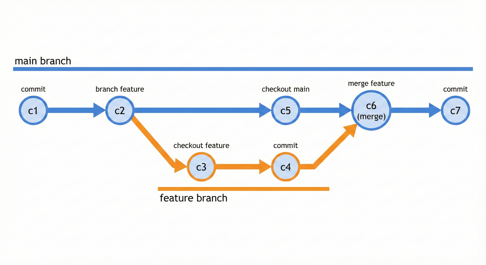
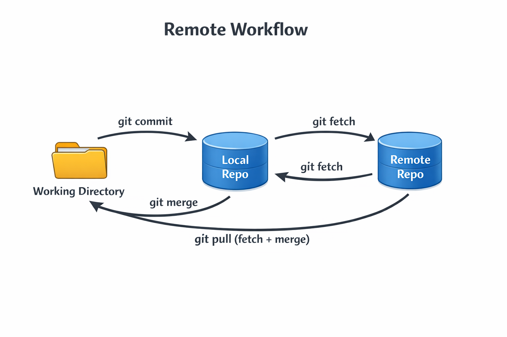
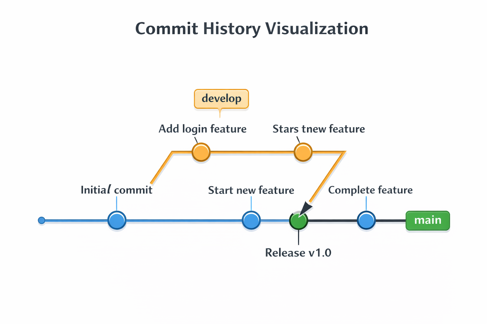
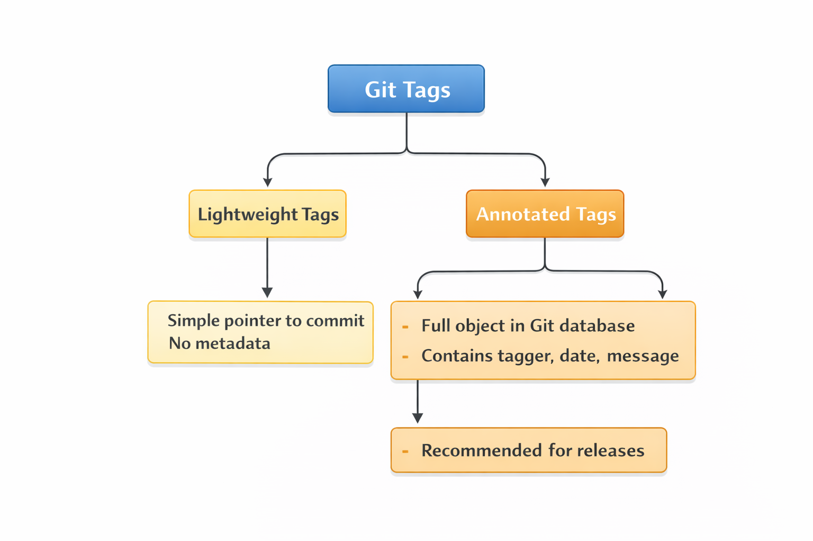
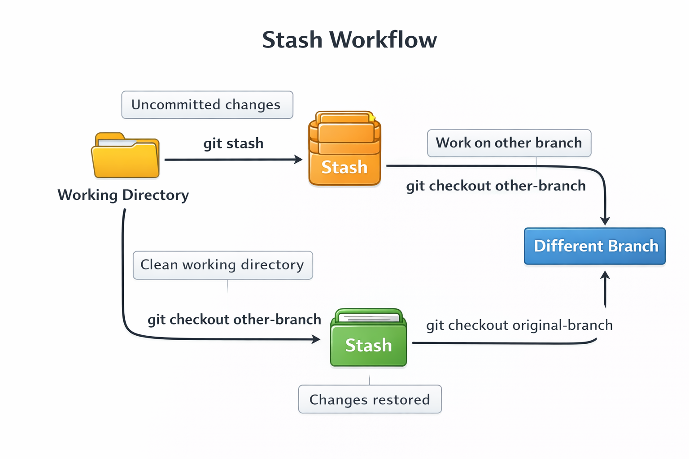
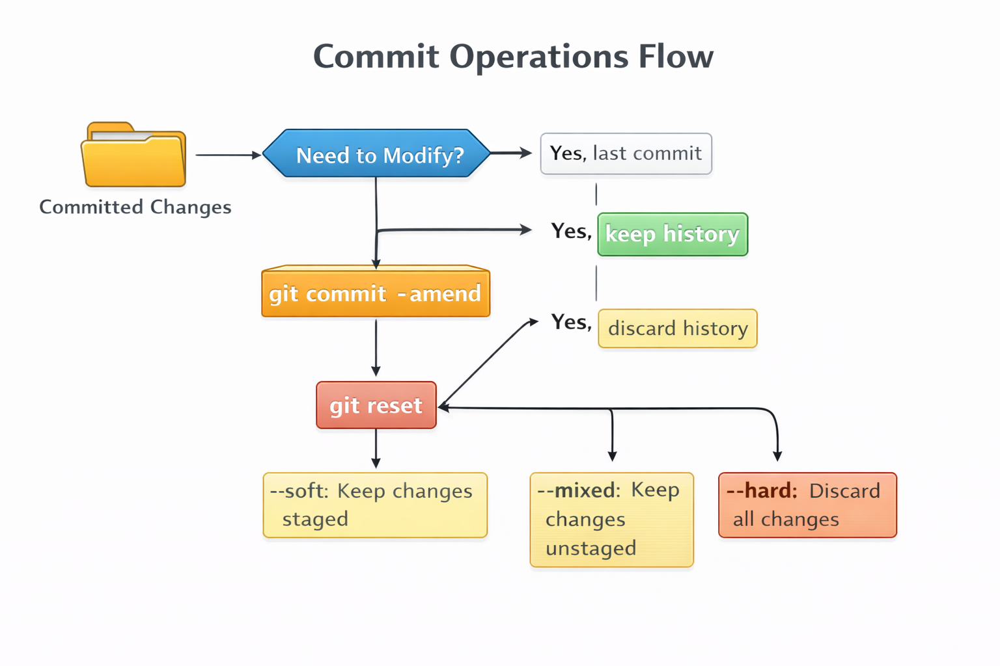
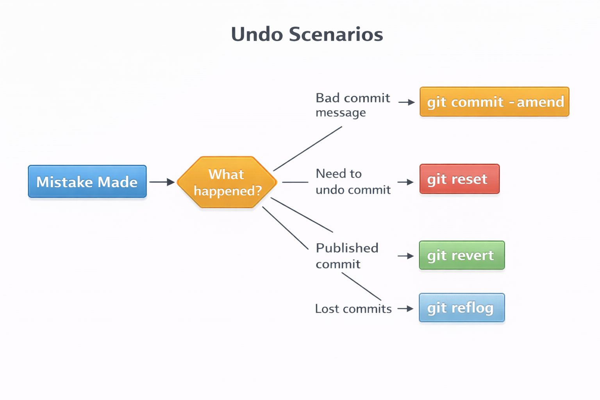
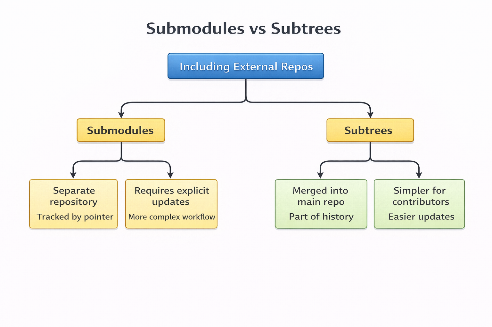
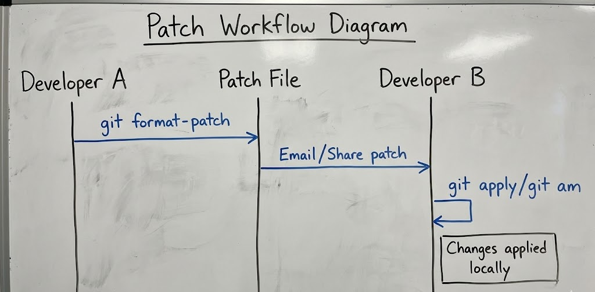
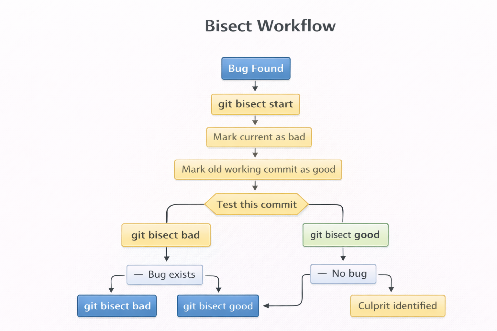

# 📘 Git Cheatsheet

**A Practical Guide to Version Control with Git**

## 1. Introduction to Git

Git is a distributed version control system that helps developers track changes, collaborate efficiently, and manage code history. It is widely used in software development, from small personal projects to large-scale enterprise systems.

This e-book serves as a concise yet structured reference for the most commonly used Git commands, including advanced workflows.

### Git Workflow Overview


**Key Concepts:**
- **Working Directory**: Where you modify files
- **Staging Area**: Where you prepare changes for commit
- **Local Repository**: Your local Git database
- **Remote Repository**: Shared repository (e.g., GitHub, GitLab)

---

## 2. Setup and Configuration

Configuration in Git allows you to customize your Git environment, set user information, and define how Git behaves. You can configure Git globally (for all repositories) or locally (for a specific repository).

### 2.1 Repository Initialization

```bash
git init
```

Initializes a new Git repository in the current directory. Creates a `.git` folder that contains all version control metadata.

```bash
git clone <url>
```

Creates a local copy of an existing remote repository, including all history and branches.

**Example:**

```bash
git clone https://github.com/user/project.git
```

### Repository Structure


### 2.2 Git Configuration

Git allows both global and local configuration. Global settings apply to all repositories, while local settings only affect the current repository.

```bash
git config --global user.name "Your Name"
git config --global user.email "you@email.com"
```

Local (repository-specific) configuration:

```bash
git config --local core.autocrlf true
```

**Why it matters**: Your name and email are attached to every commit, making it essential for collaboration and tracking contributions.

### 2.3 Advanced Configuration

```bash
git config --list
```

Displays all configured Git settings (global and local).

```bash
git config --global core.editor "code --wait"
```

Sets VS Code as the default editor for commit messages and interactive operations.

```bash
git config --global alias.st status
```

Creates a shortcut (git st → git status) to speed up common commands.

```bash
git config --global credential.helper 'cache --timeout=3600'
```

Caches credentials for one hour, so you don't need to repeatedly enter passwords.

---

## 3. File Operations

File operations in Git involve tracking changes, staging modifications, and committing them to the repository. Understanding the three states of files is crucial: modified, staged, and committed.

### File States Diagram


### 3.1 Working Directory & Staging Area

```bash
git status
```

Shows the current state of the working directory and staging area. Displays which files are modified, staged, or untracked.

```bash
git add <file>
git add .
```

Stages specific files or all changes. This prepares files for the next commit.

```bash
git commit -m "Meaningful commit message"
```

Records staged changes into history. Always write clear, descriptive commit messages.

**Best Practice**: Use present tense in commit messages (e.g., "Add feature" not "Added feature").

### 3.2 File Management

```bash
git rm <file>
```

Deletes a file from both the working directory and stages the removal for the next commit.

```bash
git mv old.txt new.txt
```

Renames or moves a file while maintaining Git history.

```bash
git diff
```

Shows unstaged changes (differences between working directory and staging area).

```bash
git diff --staged
```

Shows staged changes (differences between staging area and last commit).

### 3.3 Advanced File Tracking

```bash
git update-index --assume-unchanged <file>
```

Temporarily ignores changes to a tracked file without removing it from version control. Useful for local configuration files.

```bash
git rm --cached <file>
```

Stops tracking a file but keeps it locally. Often used with `.gitignore` for files accidentally committed.

---

## 4. Branching and Merging

Branching allows you to diverge from the main line of development and work independently without affecting the main codebase. Merging combines changes from different branches.

### Branch Workflow



### 4.1 Branch Basics

```bash
git branch
```

Lists all local branches. The current branch is marked with an asterisk (*).

```bash
git branch feature-login
```

Creates a new branch named "feature-login" but doesn't switch to it.

```bash
git checkout feature-login
```

Switches to another branch. Updates working directory to match that branch.

**Modern alternative**: `git switch feature-login`

```bash
git merge feature-login
```

Merges a branch into the current branch. Combines the histories of both branches.

### Merge Types


### 4.2 Advanced Branching

```bash
git branch -vv
```

Displays branch tracking information, including which remote branch each local branch is tracking.

```bash
git merge --abort
```

Cancels a failed merge and returns to the state before the merge attempt.

```bash
git rebase main
```

Replays commits on top of another branch, creating a linear history. **Warning**: Never rebase commits that have been pushed to a shared repository.

```bash
git rebase -i HEAD~5
```

Interactive rebase to squash, reorder, or edit the last 5 commits. Useful for cleaning up history before pushing.

### Merge vs Rebase


---

## 5. Remote Repositories

Remote repositories are versions of your project hosted on the internet or network. They enable collaboration by allowing multiple developers to push and pull changes.

### Remote Workflow



### 5.1 Managing Remotes

```bash
git remote
git remote -v
```

Lists remote repositories. The `-v` flag shows URLs for fetch and push operations.

```bash
git remote add origin <url>
```

Adds a new remote repository. "origin" is the conventional name for the main remote.

```bash
git remote show origin
```

Displays detailed remote information, including tracked branches and push/pull configurations.

### 5.2 Syncing with Remote

```bash
git fetch origin
```

Downloads updates from remote without merging. Updates remote-tracking branches but doesn't modify your working directory.

```bash
git pull origin main
```

Fetches and merges changes from the remote main branch. Equivalent to `git fetch` + `git merge`.

```bash
git push origin main
```

Uploads local commits to the remote repository.

```bash
git push -u origin main
```

Pushes and sets upstream tracking, so future `git push` commands know where to push.

### 5.3 Advanced Remote Operations

```bash
git fetch -p
```

Removes stale remote-tracking branches (prune). Cleans up references to branches that have been deleted on the remote.

```bash
git push --force origin main
```

Overwrites remote history (use cautiously). Only use when you're certain no one else is working on the branch.

**Safer alternative**: `git push --force-with-lease` (fails if remote has changes you don't have locally)

---

## 6. Commit History and Logs

Git's log system provides powerful tools to explore project history, understand changes, and debug issues. You can filter, format, and visualize commit history in various ways.

### Commit History Visualization



### Log Commands

```bash
git log
```

Displays commit history in reverse chronological order, showing commit hash, author, date, and message.

```bash
git log --oneline --graph --decorate
```

Compact visual history with branch structure. Great for understanding project flow.

```bash
git log --author="John"
```

Filters commits by author name or email.

```bash
git log --since="2024-01-01"
```

Shows commits after a specific date. Also accepts relative dates like "2 weeks ago".

**Additional useful flags:**
- `--grep="bug"` - Search commit messages
- `--until="2024-12-31"` - Commits before a date
- `-n 5` - Limit to 5 most recent commits
- `--stat` - Show file change statistics

---

## 7. Tags and Releases

Tags are references that point to specific commits, typically used to mark release points (v1.0, v2.0, etc.). Unlike branches, tags don't change once created.

### Tag Types



### Tag Commands

```bash
git tag
```

Lists all tags in alphabetical order.

```bash
git tag v1.0.0
```

Creates a lightweight tag pointing to the current commit.

```bash
git tag -a v1.1.0 -m "Release v1.1"
```

Creates an annotated tag with metadata (author, date, message). Recommended for production releases.

```bash
git push origin --tags
```

Pushes all tags to remote. By default, `git push` doesn't transfer tags.

**Tag a specific commit:**
```bash
git tag -a v1.0.0 <commit-hash> -m "Release v1.0"
```

**Delete a tag:**
```bash
git tag -d v1.0.0  # Local
git push origin --delete v1.0.0  # Remote
```

---

## 8. Stashing Changes

Stashing allows you to save uncommitted changes temporarily without committing them. This is useful when you need to switch branches but aren't ready to commit your current work.

### Stash Workflow




### Stash Commands

```bash
git stash
```

Temporarily saves uncommitted changes (both staged and unstaged) and reverts working directory to match HEAD.

```bash
git stash list
```

Lists all stashes with their identifiers and descriptions.

```bash
git stash apply stash@{0}
```

Applies a specific stash without removing it from the stash list.

```bash
git stash pop
```

Applies the most recent stash and removes it from the stash list.

```bash
git stash clear
```

Deletes all stashes. **Warning**: This is permanent and cannot be undone.

**Advanced stashing:**
```bash
git stash save "work in progress on feature X"  # Named stash
git stash -u  # Include untracked files
git stash --keep-index  # Stash unstaged changes only
```

---

## 9. Commit Management

Git provides powerful tools to modify commit history, undo changes, and fix mistakes. Understanding these commands helps maintain a clean and meaningful project history.

### Commit Operations Flow



### Commit Management Commands

```bash
git commit --amend
```

Edits the latest commit. You can modify the commit message or add forgotten files. **Note**: Don't amend commits that have been pushed to a shared repository.

```bash
git revert <commit_id>
```

Creates a new commit that undoes changes from a specific commit. Safe for shared branches as it doesn't modify history.

```bash
git reset --hard <commit_id>
```

Resets HEAD and deletes changes permanently. **Dangerous**: This discards all changes after the specified commit.

**Reset modes:**
- `--soft`: Moves HEAD, keeps changes staged
- `--mixed` (default): Moves HEAD, keeps changes unstaged
- `--hard`: Moves HEAD, discards all changes

```bash
git reflog
```

Shows history of HEAD movements, including deleted commits. Useful for recovering lost work.

### Undo Scenarios



---

## 10. Cherry-Picking

Cherry-picking allows you to apply specific commits from one branch to another. This is useful when you need a particular fix or feature without merging the entire branch.

### Cherry-Pick Workflow


### Cherry-Pick Command

```bash
git cherry-pick <commit_id>
```

Applies a commit from another branch to the current branch, creating a new commit with the same changes.

**Use cases:**
- Apply a hotfix to multiple release branches
- Move a commit made on the wrong branch
- Backport features to older versions

**Multiple commits:**
```bash
git cherry-pick commit1 commit2 commit3
git cherry-pick A..B  # Range of commits
```

**Conflict resolution:**
If conflicts occur during cherry-picking:
```bash
# Fix conflicts manually
git add <resolved-files>
git cherry-pick --continue

# Or abort the cherry-pick
git cherry-pick --abort
```

---

## 11. Submodules and Subtrees

Submodules and subtrees allow you to include external repositories within your project. They're useful for managing dependencies or shared code across multiple projects.

### Submodules vs Subtrees



### Submodule Commands

```bash
git submodule add <repo_url> <path>
```

Adds an external repository as a submodule. Creates a `.gitmodules` file to track submodule configuration.

```bash
git submodule update --init --recursive
```

Initializes and updates all submodules. Required after cloning a repository with submodules.

**Update submodules:**
```bash
git submodule update --remote  # Pull latest changes
```

### Subtree Commands

```bash
git subtree add --prefix=lib <repo_url> main
```

Embeds a repository as a subtree. The external code becomes part of your repository's history.

**Update subtree:**
```bash
git subtree pull --prefix=lib <repo_url> main
```

**Comparison:**
- **Submodules**: Better for separate, versioned dependencies
- **Subtrees**: Better for including code that will be modified

---

## 12. Hooks and Automation

Git hooks are scripts that run automatically before or after Git events. They enable automation for code quality checks, testing, and deployment.

### Hook Lifecycle


### Common Hooks

**Client-side hooks:**
- `pre-commit` - Runs before commit is created (code linting, tests)
- `prepare-commit-msg` - Modifies commit message template
- `commit-msg` - Validates commit message format
- `post-commit` - Runs after commit is created (notifications)
- `pre-push` - Runs before push (run test suite)

**Server-side hooks:**
- `pre-receive` - Runs before accepting push
- `update` - Runs for each branch being updated
- `post-receive` - Runs after push is complete

### Hook Setup

```bash
chmod +x .git/hooks/pre-commit
```

Makes the hook executable. Hooks must have execute permissions to run.

**Example pre-commit hook:**
```bash
#!/bin/sh
# Run linter before commit
npm run lint
if [ $? -ne 0 ]; then
    echo "Linting failed. Commit aborted."
    exit 1
fi
```

**Bypass hooks** (use carefully):
```bash
git commit --no-verify
```

---

## 13. Patches and Collaboration

Patches allow you to share changes as files, useful for email-based workflows or when you can't push directly to a repository.

### Patch Workflow



### Patch Commands

```bash
git format-patch <commit_id>
```

Generates patch files for commits since the specified commit. Creates one `.patch` file per commit.

**Create patches:**
```bash
git format-patch HEAD~3  # Last 3 commits
git format-patch main..feature  # All commits in feature not in main
```

```bash
git apply patch.diff
```

Applies a patch file to the working directory without creating a commit.

```bash
git am < 0001-patch-file.patch
```

Applies a patch and creates a commit with original author information.

```bash
git request-pull <start> <end> <url>
```

Creates a pull request summary showing changes between commits. Useful for generating release notes.

**Check if patch applies cleanly:**
```bash
git apply --check patch.diff
```

---

## 14. Debugging and Performance

Git provides tools for finding bugs through binary search, checking repository health, and optimizing performance.

### Bisect Workflow



### Debugging Commands

```bash
git bisect start
```

Starts binary search to find which commit introduced a bug.

```bash
git bisect bad
git bisect good <commit_id>
```

Marks the current commit as bad and a known good commit. Git will then help you test commits in between.

**Bisect workflow:**
1. `git bisect start`
2. `git bisect bad` (current broken state)
3. `git bisect good <commit>` (known working state)
4. Test each commit Git checks out
5. Mark as `good` or `bad`
6. Git identifies the problematic commit
7. `git bisect reset` to return to original state

**Automate bisect:**
```bash
git bisect run npm test  # Automatically test each commit
```

### Maintenance Commands

```bash
git fsck
```

Checks repository integrity. Verifies connectivity and validity of objects in the database.

```bash
git gc
```

Optimizes repository performance by cleaning up unnecessary files and compressing file revisions.

**Additional maintenance:**
```bash
git prune  # Remove unreachable objects
git repack  # Compress objects for efficiency
```

---

## 15. Tips and Best Practices

These advanced tips help you work more efficiently with Git and maintain better code quality.

### Best Practices Checklist


### Advanced Tips

```bash
git add -p
```

Stage changes interactively, choosing specific hunks to include. Allows you to split changes into logical commits.

```bash
git log -p file.txt
```

View file-level history with full diffs. See how a specific file evolved over time.

```bash
git clean -df
```

Remove untracked files and directories. **Warning**: This is permanent, use carefully.

**Safe preview:**
```bash
git clean -dn  # Dry run, shows what would be deleted
```

```bash
git commit --allow-empty -m "Trigger CI"
```

Creates an empty commit. Useful for triggering CI/CD pipelines without code changes.

### Additional Best Practices

1. **Write meaningful commit messages**: Use conventional commits format
   ```
   feat: add user authentication
   fix: resolve memory leak in parser
   docs: update API documentation
   ```

2. **Keep commits atomic**: Each commit should represent one logical change

3. **Pull before push**: Always sync with remote before pushing your changes

4. **Use .gitignore**: Exclude build artifacts, dependencies, and sensitive files

5. **Regular backups**: Push to remote frequently; Git is not a backup system by itself

6. **Branch naming conventions**: Use descriptive names like `feature/user-auth` or `bugfix/login-error`

### Useful Aliases

Add these to your `.gitconfig`:

```bash
git config --global alias.co checkout
git config --global alias.br branch
git config --global alias.ci commit
git config --global alias.st status
git config --global alias.unstage 'reset HEAD --'
git config --global alias.last 'log -1 HEAD'
git config --global alias.visual 'log --oneline --graph --decorate --all'
```

---

## Quick Reference Summary

### Essential Commands

| Operation | Command |
|-----------|---------|
| Initialize repo | `git init` |
| Clone repo | `git clone <url>` |
| Check status | `git status` |
| Stage changes | `git add .` |
| Commit | `git commit -m "message"` |
| Push | `git push origin main` |
| Pull | `git pull origin main` |
| Create branch | `git branch <name>` |
| Switch branch | `git checkout <name>` |
| Merge branch | `git merge <name>` |

### Emergency Commands


---

## Conclusion

Git is a powerful tool that becomes more valuable as you master its features. Start with the basics, gradually incorporate advanced commands, and always remember:

1. **Commit often** - Small, frequent commits are easier to manage
2. **Write clear messages** - Future you will thank present you
3. **Branch fearlessly** - Branches are cheap and safe
4. **Push regularly** - Don't let local changes pile up
5. **Learn from mistakes** - Git's reflog can save you from most disasters

Happy coding!❤️
